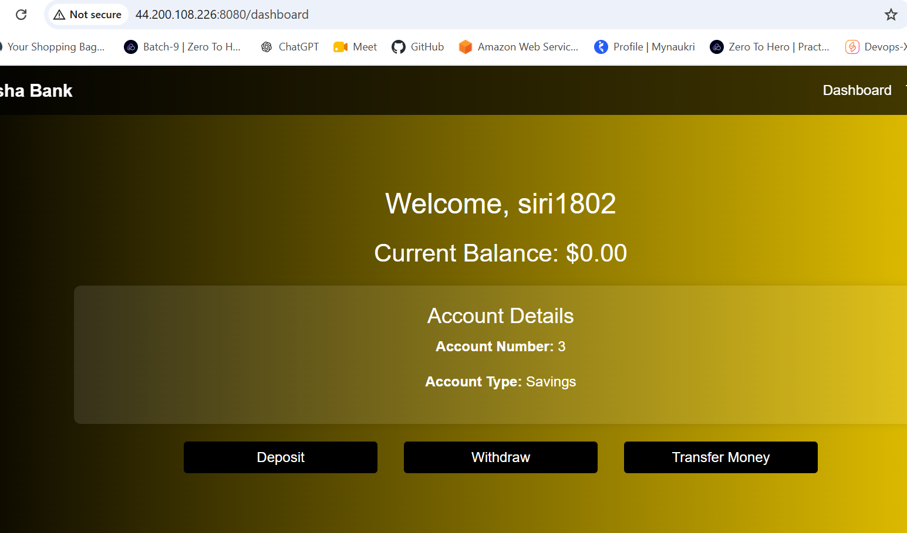
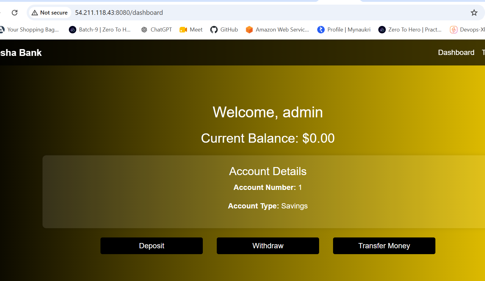
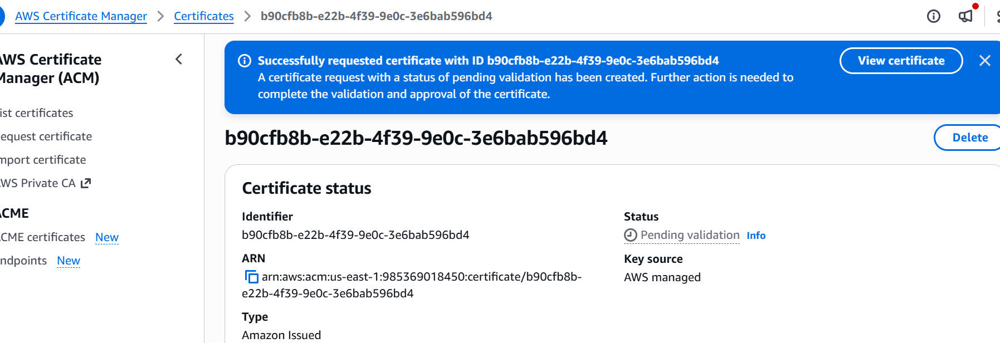
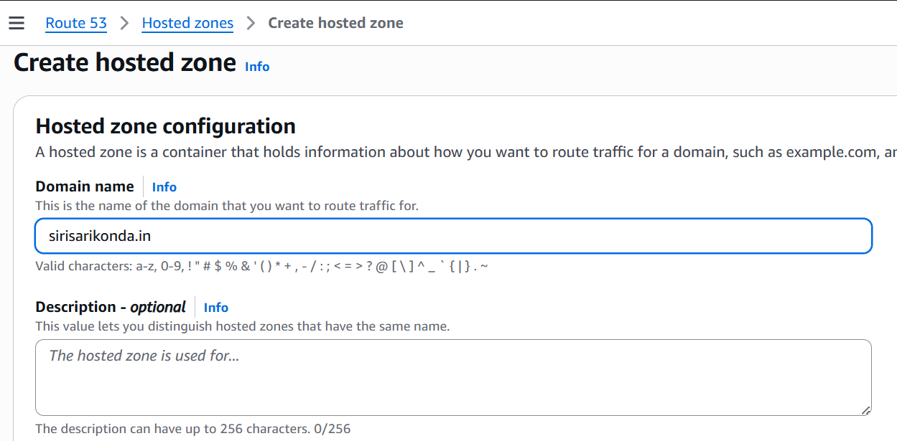
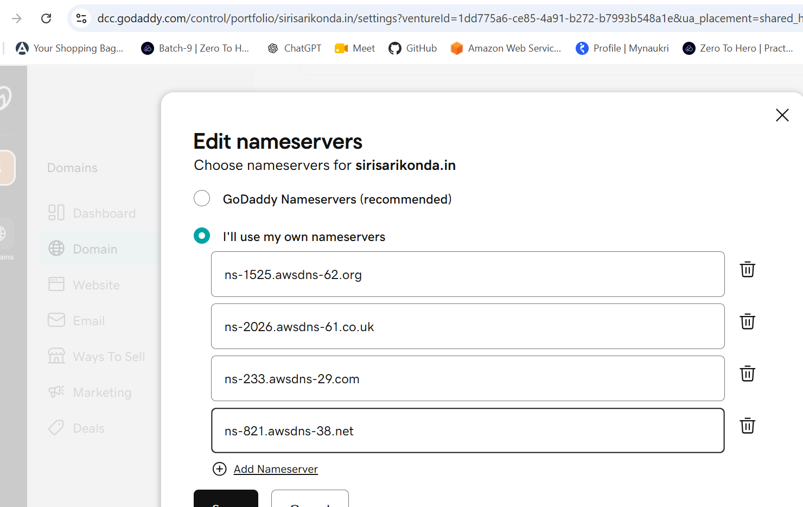
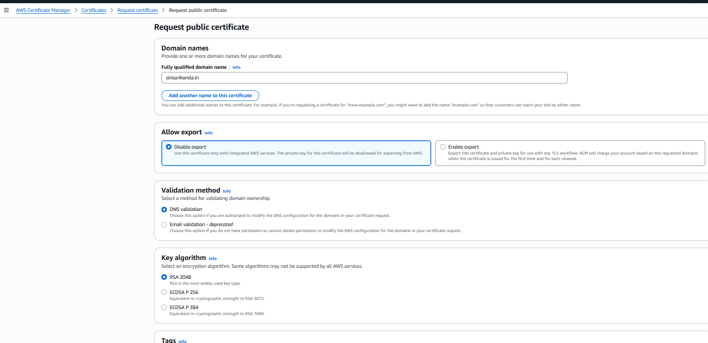
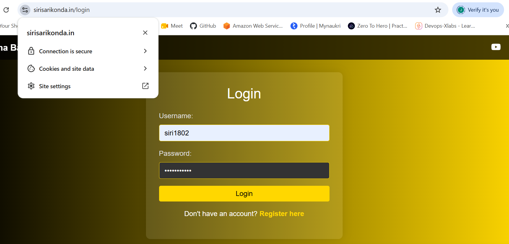

# Highly Available AWS Cloud Architecture

BankApp is a Spring Boot application deployed on AWS using a highly available, scalable architecture across multiple Availability Zones. The solution uses Route 53, CloudFront, AWS WAF, ACM, Application Load Balancer, EC2 Auto Scaling, and Amazon RDS to provide secure traffic management, application scalability, and database reliability.

### Screenshot: Architecture


---

# Architecture Overview

Architecture Overview

This architecture deploys a Spring Boot BankApp application on AWS using a highly available, scalable, and secure multi-AZ design.

The architecture uses two Availability Zones (us-east-1a and us-east-1b) to reduce dependency on a single AZ and provide application availability:

## 1. Web Tier

- Two EC2 instances
- Deployed in Public Subnets
- Distributed across two Availability Zones
- Receives user requests through an Application Load Balancer

## 2. Database Tier

- Amazon RDS
- Deployed in Private Database Subnets
- Database is isolated from direct internet access
- Accessible only from the Application Tier
- Uses a Writer instance for database writes
- Uses a Reader/Read Replica for read workloads

## 3. Traffic & Security Layer

- Route 53 handles DNS resolution for the application domain
- CloudFront acts as the entry point for application traffic
- AWS WAF provides web application protection
- AWS Certificate Manager (ACM) provides SSL/TLS certificates for HTTPS
- Application Load Balancer distributes incoming traffic across EC2 instances

## 4. Network Layer

- Dedicated AWS Virtual Private Cloud (VPC)
- Spans two Availability Zones:
      - us-east-1a
      - us-east-1b  
- Public Subnets host the application instances in the current design
- Private Subnets host the RDS database
- Security Groups control communication between the ALB, EC2, and RDS layers

---


# Architecture Flow

```text
Client
   |
   v
Route 53
   |
   v
CloudFront
   |
   v
AWS WAF
   |
   v
Application Load Balancer
   |
   +-------------------+
   |                   |
   v                   v
EC2 - AZ 1a        EC2 - AZ 1b
   |                   |
   +---------+---------+
             |
             v
        Amazon RDS
        /         \
    Writer       Reader
```

---

# AWS Services Used

- Amazon VPC
- Amazon EC2
- Application Load Balancer (ALB)
- Amazon RDS
- Internet Gateway
- Route Tables
- Security Groups
- Public Subnets
- Private Subnets
- ACM
- Route53
- WAF
- Cloud front

---

# Step 1: Create a VPC

Create a VPC with the required CIDR block.

Example:

```text
VPC Name: three-tier-vpc
CIDR Block: 10.0.0.0/16
```

---

# Step 2: Create Subnets

Create subnets across two Availability Zones.

| Tier | Availability Zone 1 | Availability Zone 2 |
|---|---|---|
| Web Tier | Public Subnet 1 | Public Subnet 2 |
| Database Tier | Private DB Subnet 1 | Private DB Subnet 2 |

The subnets should use non-overlapping CIDR ranges.

---

# Step 3: Create an Internet Gateway

1. Open the AWS VPC Console.
2. Go to **Internet Gateways**.
3. Create an Internet Gateway.
4. Attach the Internet Gateway to the VPC.

The Internet Gateway provides internet connectivity to resources in the Public Subnets.

---

# Step 4: Configure Public Route Table

Create a Public Route Table and associate it with:

- Public Subnet 1
- Public Subnet 2

Add the following route:

```text
Destination: 0.0.0.0/0
Target: Internet Gateway
```

---

# Step 5: Create Security Groups

## ALB Security Group

Allow:

| Type | Port | Source |
|---|---:|---|
| HTTP | 80 | 0.0.0.0/0 |
| HTTPS | 443 | 0.0.0.0/0 |

---

## Web Server Security Group

Allow HTTP traffic from the ALB Security Group.

| Type | Port | Source |
|---|---:|---|
| Custom TCP | 8080 | ALB Security Group |

For Spring Boot, the application normally listens on: 8080
So do not allow port 8080 from 0.0.0.0/0.

SSH should be restricted to trusted administrative access.

---

## RDS Security Group

Allow database traffic only from the Application Server Security Group.

For MySQL:

| Type | Port | Source |
|---|---:|---|
| MySQL/Aurora | 3306 | Application Security Group |

---

# Step 6: Create Amazon RDS

Create an RDS database.

Recommended configuration:

```text
Public Access: No
Database Subnet Group: Private Database Subnets
Security Group: RDS Security Group
```

The database should not be directly accessible from the internet.

---

# Step 7: Test RDS Connectivity

Install the MySQL client:

```bash
sudo apt update
sudo apt install mysql-client -y
```

Test port connectivity:

```bash
nc -zv RDS_ENDPOINT 3306
```

Connect to the database:

```bash
mysql -h RDS_ENDPOINT -P 3306 -u USERNAME -p
```
Create a database:

```bash
create database bankapp;
use bankapp;
```

> Note: Do not use `curl` to test MySQL connectivity because MySQL on port 3306 does not use the HTTP protocol.

---

# Step 8: Launch Web Tier EC2 Instances

Launch two EC2 instances:

```text
Web EC2 1 → Public Subnet 1
Web EC2 2 → Public Subnet 2
```

Clone the git repository:

```bash
sudo apt update
git clone https://github.com/sireesha1802/Project-CI.git
cd Project-CI
cd /src/main/resources
vi application.properties
apt install openjdk-17-jdk -y
apt install maven -y
mvn clean package

In application.properties you need to modify your database name ,username and password also replace the database url with your rds endpoint
```

Verify:

```browser
publicip:8080
```

### Screenshot: web server1 output



Do same for the web server 2

### Screenshot: web server2 output


---

# Step 9: Create Target Groups

Create target groups for the EC2 instances.

Example configuration:

```text
Target Type: Instance
Protocol: HTTP
Port: 8080
```

Register the required EC2 instances.

Configure the health check path based on your application.


---

# Step 10: Create Application Load Balancer

Create an Internet-facing Application Load Balancer.

Configuration:

```text
Scheme: Internet-facing
IP Address Type: IPv4

Subnets:
- Public Subnet 1
- Public Subnet 2

Security Group:
- ALB Security Group
```

Create a listener:

```text
Protocol: HTTP
Port: 80
```

Configure the listener to forward requests to the target group.

---

# Step 11: Create SSL/TLS Certificate using AWS Certificate Manager (ACM)

ACM is used to create an SSL/TLS certificate for the BankApp domain so that the application can be accessed securely over HTTPS.

Request a Certificate

```bash
AWS Console → Certificate Manager (ACM)
Request a public certificate
sirisarikonda.in(Enter your domain name)
DNS Validation
Then click Request
The certificate status will initially show: Pending validation
```
### Screenshot: ACM Pending validation



# Step 12: Create Route 53 Hosted Zone

```bash
AWS Console → Route 53 → Hosted Zones
sirisarikonda.in(Enter your domain name)
Route 53 will provide Name Server (NS) records.
Go to your domain registrar and replace the existing name servers with the Route 53 name servers.
```

### Screenshot: Hostedzone created



The hosted zone alone does not move DNS control to Route 53. The domain registrar must use the Route 53 NS records.

### Screenshot: NS Records added




# Step 13: Validate the ACM Certificate

```bash
Return to AWS Console → ACM → Your Certificate
click on Create records in Route 53
```
ACM will automatically create the required CNAME record in the Route 53 hosted zone.

Certificate Validation 

```bash
Pending validation to Issued
```
### Screenshot: ACM Certificate Issued




# step 14: Create CloudFront Distribution

CloudFront is used as the public entry point for the BankApp application. It receives requests from users and forwards them to the Application Load Balancer (ALB).

## Create CloudFront Distribution

```bash
AWS Console → CloudFront → Distributions → Create Distribution

```
## Distribution Settings

```bash
provide Distribution name: BankApp-CloudFront
Select the appropriate Distribution Type.
For the application domain, enter your domain name, for example: sirisarikonda.in
Click Next.
```

## Configure the Origin

```bash
Origin type: Application Load Balancer
Origin protocol: HTTP only
```
This means CloudFront communicates with the ALB using HTTP.

CloudFront ──HTTP──> ALB

## Configure Cache Settings

Under Cache settings, select:

```bash
Customize cache settings
Redirect HTTP to HTTPS
```
This ensures that users accessing the application over HTTP are automatically redirected to HTTPS.


```text
http://bankapp.example.com
          |
          v
   Redirect to HTTPS
          |
          v
https://bankapp.example.com

```

---

## Configure AWS WAF

AWS WAF is used to protect the BankApp application from common web-based attacks and unwanted traffic.

# Create a Web ACL

```bash
AWS Console → WAF & Shield → Web ACLs
Create web ACL
```
# Select Application Category

```bash
App focus
```
# Select AWS Resource

```bash
CloudFront distribution
choose the cloudfront of your's
```

# Choose Recommended Protection

```bash
Recommended protection
Give name of the web ACl
click on create
```

### Screenshot: WAF created


# flow

```text
User
  |
  v
Route 53
  |
  v
CloudFront
  |
  v
AWS WAF
  |
  v
Application Load Balancer
  |
  v
EC2
```

Since CloudFront is a global service, a WAF Web ACL associated with CloudFront is managed in US East (N. Virginia) / us-east-1.

---

## Configure Route 53 DNS

Route 53 is used to route the BankApp domain to the CloudFront distribution.

# Create an A Record

```bash
Record type                A – IPv4 address
Record name                bankapp
Route traffic to           Alias to CloudFront distribution
CloudFront distribution    Select your BankApp CloudFront distribution
Click on create record
```

For the root domain (sirisarikonda.in), create an A record with an Alias to CloudFront and leave the record name blank.

---

## Output

After creating the Route 53 record, the BankApp domain will resolve to the CloudFront distribution.

### Screenshot: Final output

