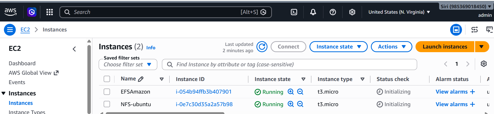
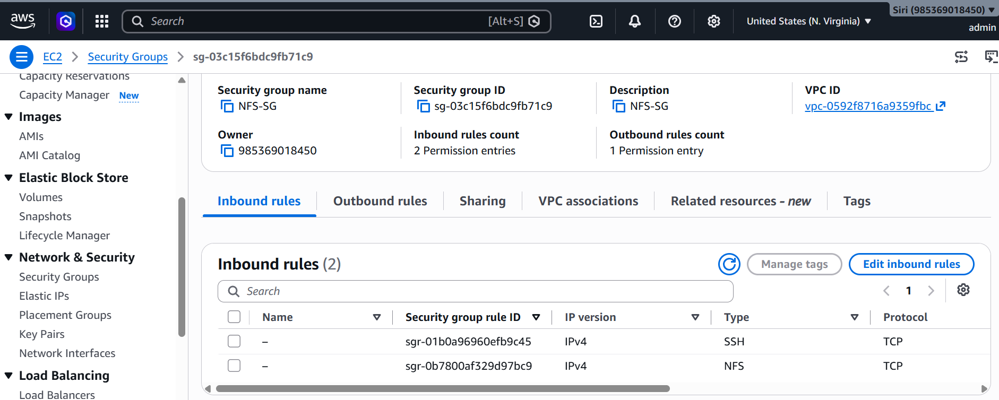
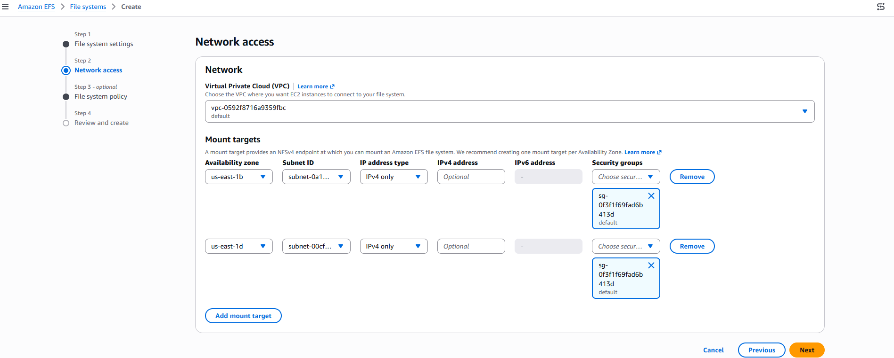
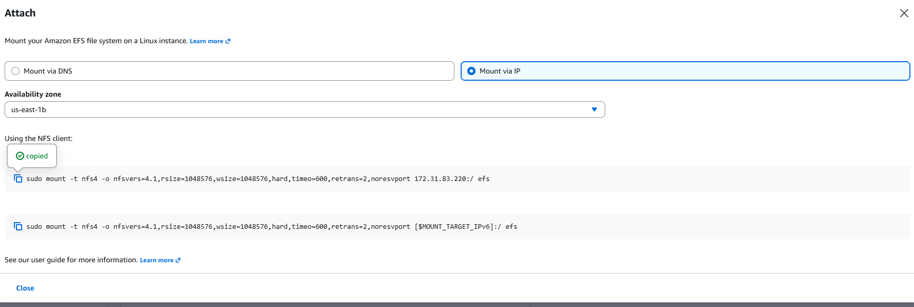
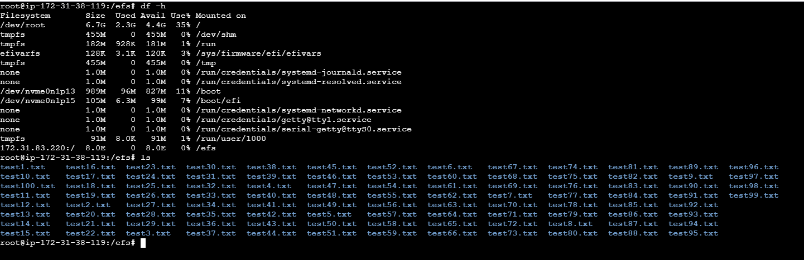
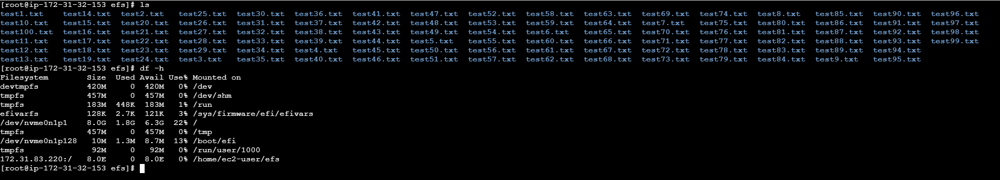

# Amazon Elastic File System (EFS)

## What is Amazon EFS?

Amazon Elastic File System (EFS) is a fully managed, scalable **Network File System (NFS)** provided by AWS. It allows multiple EC2 instances to **simultaneously access and share the same files**.

Unlike Amazon EBS, which is attached to a single EC2 instance (or supports limited multi-attach in specific scenarios), Amazon EFS is designed for **shared file storage** that can be mounted by multiple EC2 instances at the same time.

---

# Why is EFS Used?

EFS is used when multiple servers or applications need access to the **same files simultaneously**.

### Example

Suppose you have:

* **EC2 Instance 1** – Web Server A
* **EC2 Instance 2** – Web Server B

Both servers need access to:

* User-uploaded images
* Documents
* Videos
* Shared configuration files

Instead of storing these files separately on each EC2 instance, you mount the same EFS file system on both servers.

```text
             Amazon EFS
          +----------------+
          | Shared Storage |
          +----------------+
            /            \
           /              \
+----------------+   +----------------+
| EC2 Instance 1 |   | EC2 Instance 2 |
|   Web Server A |   |   Web Server B |
+----------------+   +----------------+
        |                     |
        +------ Same Files ---+
```

If a file is created on **EC2 Instance 1**, it is immediately available on **EC2 Instance 2**.

---

# Architecture

```text
                Amazon EFS
            +------------------+
            |  Shared Storage  |
            +------------------+
              /              \
             /                \
     +-------------+    +-------------+
     | EC2 Server1 |    | EC2 Server2 |
     |   Ubuntu    |    | Amazon Linux|
     +-------------+    +-------------+
```

Both servers access the same shared file system.

---

# Prerequisites

* Two EC2 instances (Ubuntu and Amazon Linux)
* Both instances in the **same VPC**
* Same AWS Region
* Security groups configured
* SSH access to both instances

---

# Step 1: Launch Two EC2 Instances

Create the following EC2 instances:

* Ubuntu
* Amazon Linux

### Screenshot: Launch EC2 Instances



Connect to both EC2 instances using SSH.


---

# Step 2: Install EFS Utilities

## Ubuntu

```bash
sudo apt update
sudo apt install -y amazon-efs-utils
```

If `amazon-efs-utils` is not available:

```bash
sudo apt install -y nfs-common
```

## Amazon Linux 2

```bash
sudo yum install -y amazon-efs-utils
```

---

# Step 3: Configure Security Groups

## EFS Security Group

### Screenshot: EFS Security Group



Add the following inbound rule:

| Type | Protocol | Port | Source             |
| ---- | -------- | ---- | ------------------ |
| NFS  | TCP      | 2049 | EC2 Security Group |

Example:

```text
Type   : NFS
Port   : 2049
Source : sg-xxxxxxxx (EC2 Security Group)
```

### EC2 Security Group

Ensure outbound traffic is allowed (the default outbound rule is sufficient).

---

# Step 4: Create Amazon EFS

1. Sign in to the AWS Management Console.
2. Search for **Amazon EFS**.
3. Open **Elastic File System**.
4. Click **Create file system**.
5. Select **Customize**.

---

# Step 5: Configure the Network

### Screenshot: Configure the Network



Configure the following settings:

| Option        | Value                                                   |
| ------------- | ------------------------------------------------------- |
| VPC           | Select your EC2 VPC                                     |
| Mount Targets | Create mount targets in the required Availability Zones |

For each mount target:

* Select the subnet where your EC2 instance resides.
* Select or create the EFS security group.

Example:

| Availability Zone | Subnet                |
| ----------------- | --------------------- |
| us-east-1a        | Public/Private Subnet |
| us-east-1b        | Public/Private Subnet |

Click **Next**, review the configuration, and create the EFS file system.

---

# Step 6: Create a Mount Directory

Run the following command on **both EC2 instances**:

```bash
sudo mkdir efs
```

---

# Step 7: Mount the EFS File System

From the EFS console, copy the **mount command** or **DNS name**.

### Screenshot: Mount the EFS File System



Example:

```bash
sudo mount -t efs fs-xxxxxxxx:/ /mnt/efs
```

If you are using NFS:

```bash
sudo mount -t nfs4 fs-xxxxxxxx.efs.us-east-1.amazonaws.com:/ /mnt/efs
```

Run the appropriate command on **both EC2 instances**.

---

# Step 8: Verify the Mount

Run the following command:

```bash
df -h
```

### Screenshot: Verify the Mount
### output1

### output2


Expected output:

```text
Filesystem      Size  Used Avail Mounted on
127.0.0.1:/     8.0E     0  8.0E /efs
```

You can also verify using:

```bash
mount | grep efs
```

---

# Step 9: Test Shared Storage

### On EC2 Instance 1

```bash
echo "Hello from Server 1" | sudo tee /mnt/efs/test.txt
```

### On EC2 Instance 2

```bash
cat /mnt/efs/test.txt
```

Expected output:

```text
Hello from Server 1
```

This confirms that both EC2 instances are successfully sharing the same Amazon EFS file system.

---

# Conclusion

In this project, you:

* Created two EC2 instances (Ubuntu and Amazon Linux)
* Created an Amazon EFS file system
* Configured security groups for NFS access
* Mounted the EFS file system on both instances
* Verified the mount
* Confirmed shared storage by accessing the same file from both servers
