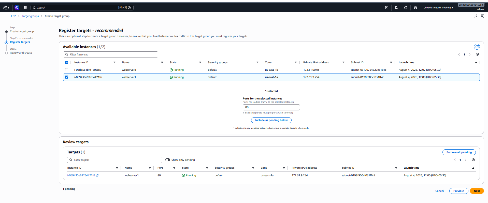
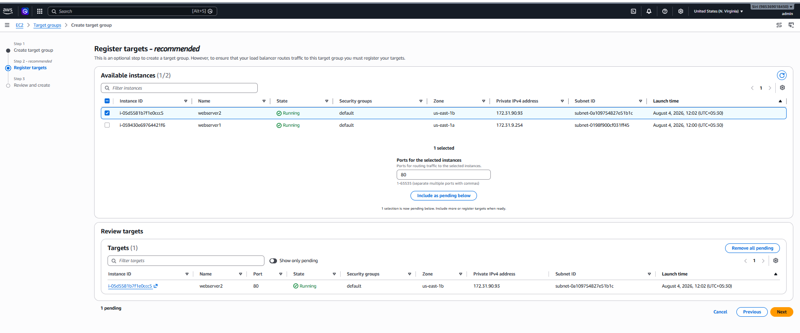
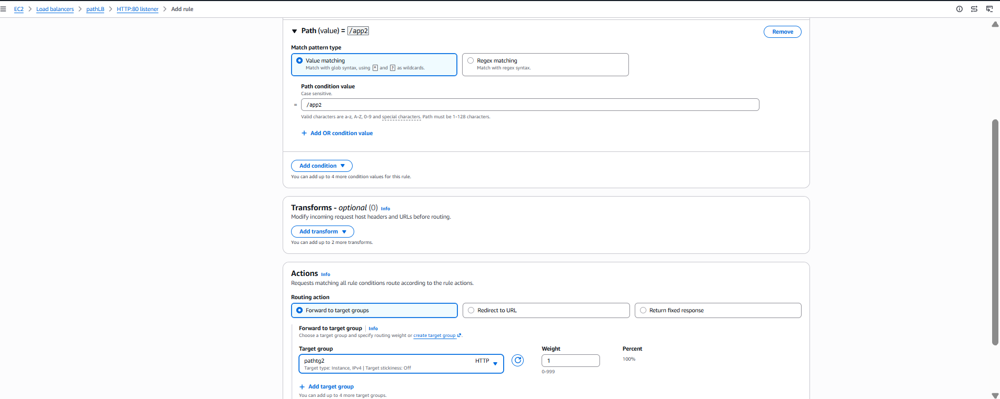
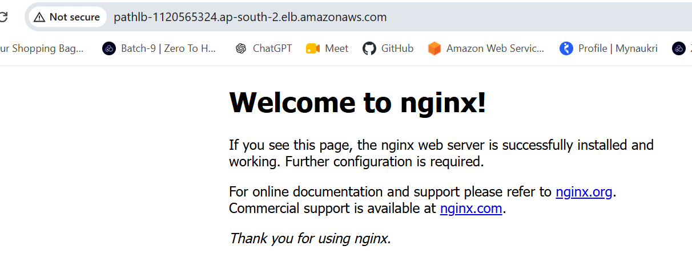
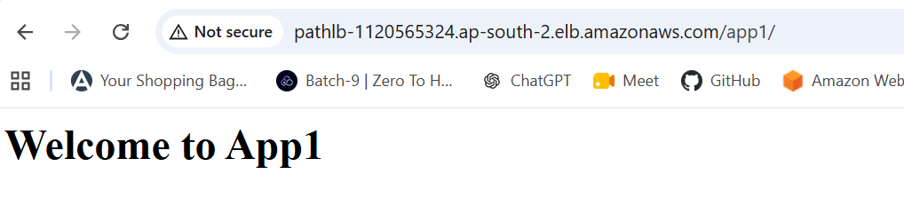
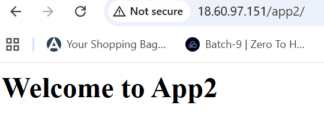

# AWS Application Load Balancer (ALB) – Path-Based Routing

## What is a Load Balancer?

A **Load Balancer** is a service that distributes incoming client requests across multiple servers (such as Amazon EC2 instances). This prevents any single server from becoming overloaded and improves an application's **availability, performance, scalability, and fault tolerance**.

In AWS, load balancing is provided by **Elastic Load Balancing (ELB)**.

---

## Why Use a Load Balancer?

A Load Balancer helps to:

* Distribute traffic evenly across multiple servers.
* Improve high availability by routing requests only to healthy instances.
* Increase scalability by allowing instances to be added or removed easily.
* Prevent server overload by balancing incoming traffic.
* Provide fault tolerance by automatically avoiding unhealthy instances.

---

## What is an Application Load Balancer (ALB)?

An **Application Load Balancer (ALB)** is an AWS Elastic Load Balancer that operates at **Layer 7 (Application Layer)** of the OSI model.

It is designed to intelligently route **HTTP** and **HTTPS** traffic based on application-level information.

### ALB Routing Capabilities

* URL path
* Host name (domain)
* HTTP headers
* Query string parameters

---

# AWS ALB Path-Based Routing – Step-by-Step

## Architecture

```text
                    Internet
                        |
                        |
          Application Load Balancer
                   (HTTP : 80)
                        |
          +-------------+-------------+
          |                           |
      /app1/*                     /app2/*
          |                           |
     Target Group 1             Target Group 2
          |                           |
      EC2 Instance 1             EC2 Instance 2
```

---

# Prerequisites

* ✅ Two EC2 instances (Ubuntu or Amazon Linux)
* ✅ Nginx or Apache installed on both instances
* ✅ Two different web pages
* ✅ Both instances in the same VPC
* ✅ Internet-facing Application Load Balancer
* ✅ Security Groups configured correctly

---

# Step 1: Launch Two EC2 Instances

Launch two EC2 instances.

Example:

* **EC2-1** → App1
* **EC2-2** → App2

---

# Step 2: Install Nginx

## Ubuntu

```bash
sudo apt update
sudo apt install nginx -y
sudo systemctl enable nginx
sudo systemctl start nginx
```

## Amazon Linux

```bash
sudo yum install nginx -y
sudo systemctl enable nginx
sudo systemctl start nginx
```

---

# Step 3: Create the Application Pages

## EC2 Instance 1

```bash
sudo mkdir -p /var/www/html/app1
echo "<h1>Welcome to App1</h1>" | sudo tee /var/www/html/app1/index.html
```

## EC2 Instance 2

```bash
sudo mkdir -p /var/www/html/app2
echo "<h1>Welcome to App2</h1>" | sudo tee /var/www/html/app2/index.html
```

Restart Nginx:

```bash
sudo systemctl restart nginx
```

Verify:

```
http://<EC2-1-Public-IP>/app1/
```

```
http://<EC2-2-Public-IP>/app2/
```

---

# Step 4: Create Target Group 1

Navigate to:

**EC2 Console → Target Groups → Create Target Group**

Configure:

| Setting     | Value     |
| ----------- | --------- |
| Target Type | Instances |
| Name        | TG-App1   |
| Protocol    | HTTP      |
| Port        | 80        |
| VPC         | Your VPC  |

### Health Check

| Setting  | Value    |
| -------- | -------- |
| Protocol | HTTP     |
| Path     | / |

Register **EC2 Instance 1**.

Click **Create Target Group**.

### Screenshot: Target Group 1



---

# Step 5: Create Target Group 2

Create another Target Group.

| Setting  | Value   |
| -------- | ------- |
| Name     | TG-App2 |
| Protocol | HTTP    |
| Port     | 80      |

### Health Check

| Setting  | Value    |
| -------- | -------- |
| Protocol | HTTP     |
| Path     | / |


Register **EC2 Instance 2**.

Click **Create**.

### Screenshot: Target Group 2



---

# Step 6: Create an Application Load Balancer

Navigate to:

**EC2 Console → Load Balancers → Create Load Balancer**

Choose:

* **Application Load Balancer**

Configure:

| Setting            | Value                              |
| ------------------ | ---------------------------------- |
| Name               | My-ALB                             |
| Scheme             | Internet-facing                    |
| IP Address Type    | IPv4                               |
| VPC                | Your VPC                           |
| Availability Zones | Select at least two public subnets |

### Security Group

Allow:

| Type | Port |
| ---- | ---- |
| HTTP | 80   |

### Listener

| Protocol | Port |
| -------- | ---- |
| HTTP     | 80   |

### Default Action

Forward to:

```
TG-App1
```

Click **Create Load Balancer**.


---

# Step 7: Configure Path-Based Routing

Navigate to:

**EC2 → Load Balancers → My-ALB → Listeners → HTTP:80 → View/Edit Rules**

### Rule 1

**Condition**

```
Path is /app1/*
```

**Action**

```
Forward to TG-App1
```

---

### Rule 2

Click **Add Rule**

**Condition**

```
Path is /app2/*
```

**Action**

```
Forward to TG-App2
```

Save the rules.

### Screenshot: Add path /app2


---

# Step 8: Verify Target Health

Navigate to:

**EC2 → Target Groups**

Both target groups should display:

```
Healthy
```

If a target is unhealthy, verify:

* Nginx or Apache is running.
* Port **80** is open in the EC2 security group.
* The configured health check path returns **HTTP 200**.
* The instance is registered with the correct target group.

---

# Step 9: Test Path-Based Routing

Copy the **ALB DNS Name**.

Example:

```
http://my-alb-123456.us-east-1.elb.amazonaws.com
```

### Screenshot: Output default




### Test App1

```
http://my-alb-123456.us-east-1.elb.amazonaws.com/app1/
```

Expected output:

```
Welcome to App1
```

---

### Test App2

```
http://my-alb-123456.us-east-1.elb.amazonaws.com/app2/
```

Expected output:

```
Welcome to App2
```

### Screenshot: Output app1



### Screenshot: Output app2



---

# Troubleshooting

If only one path works:

* Verify both target groups are **Healthy**.
* Confirm the listener rules use the correct path patterns (`/app1/*` and `/app2/*`).
* Ensure the application actually serves content at `/app1/` and `/app2/`.
* Confirm the health check path returns **HTTP 200**.
* Check that the EC2 security group allows HTTP (port 80) from the ALB security group.
* Validate the Nginx configuration using:

```bash
sudo nginx -t
```

* Restart Nginx after making changes:

```bash
sudo systemctl restart nginx
```
