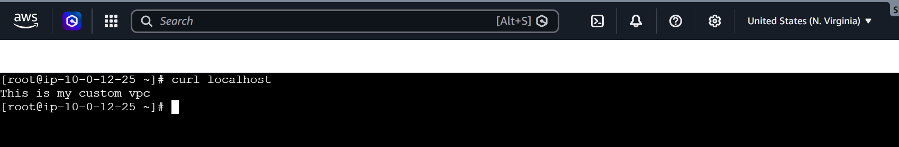
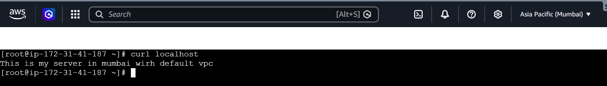
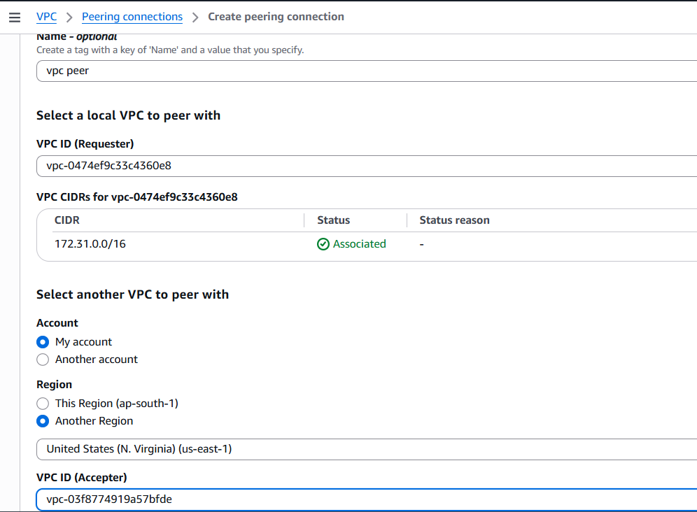
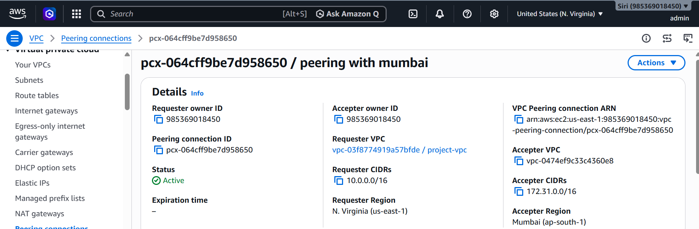
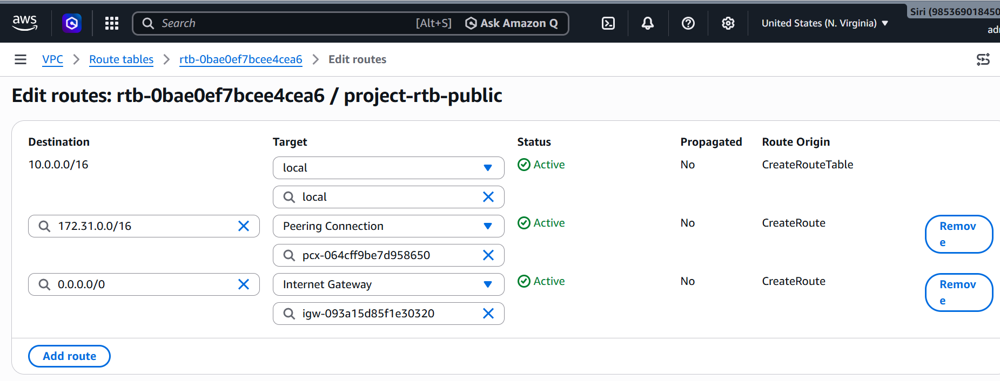
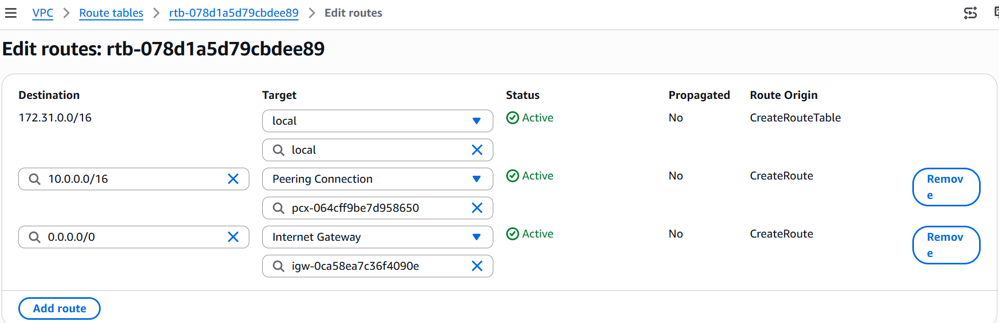
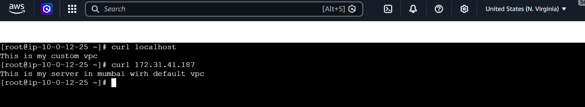
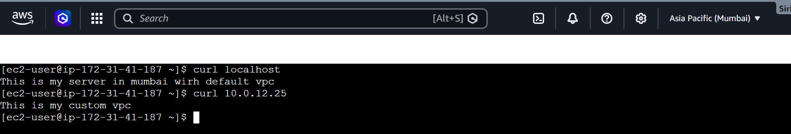

# Cross-Region VPC Peering Between Two AWS Regions (Step-by-Step)

## Overview

This guide explains how to create a **Cross-Region VPC Peering Connection** between two VPCs located in different AWS Regions.

### Example

- **Region 1:** N. Virginia (`us-east-1`) – **Custom VPC**
- **Region 2:** Mumbai (`ap-south-1`) – **Default VPC**

# Prerequisites


Before creating the VPC Peering Connection, ensure the following:

- Two VPCs exist in different AWS Regions.
- The VPC CIDR blocks must **not overlap**.
- One EC2 instance is launched in each VPC.
- Security Groups allow **ICMP**, **SSH**, and **HTTP** traffic.


| Region | VPC Type | CIDR Block |
|---------|----------|------------|
| N. Virginia | Custom VPC | `10.0.0.0/16` |
| Mumbai | Default VPC | `172.31.0.0/16` |


---

# Step 1: Launch EC2 Instances

Launch one EC2 instance in each region.

## N. Virginia (`us-east-1`)

- Launch an Amazon Linux EC2 instance in the **Custom VPC**.

### Install NGINX

```bash
sudo -i
yum update -y
yum install nginx -y
cd /usr/share/nginx/html
rm index.html
vi index.html
systemctl status nginx
systemctl start nginx
systemctl enable nginx
```

Verify NGINX:

```bash
curl localhost
```

### Screenshot: N.viriginia output




---

## Mumbai (`ap-south-1`)

- Launch an Amazon Linux EC2 instance in the **Default VPC**.

### Install NGINX

```bash
sudo -i
yum update -y
yum install nginx -y
cd /usr/share/nginx/html
rm index.html
vi index.html
systemctl status nginx
systemctl start nginx
systemctl enable nginx
```

Verify NGINX:

```bash
curl localhost
```

### Screenshot: Mumbai Output




---

# Step 2: Open the VPC Console

1. Login to the AWS Management Console.
2. Navigate to **VPC Dashboard**.
3. Select the **N. Virginia (`us-east-1`)** region.


---

# Step 3: Create the VPC Peering Connection

Navigate to:

```
VPC
└── Peering Connections
```

Click **Create Peering Connection**.

Enter the following details:

| Field | Value |
|-------|-------|
| Name | Virginia-Mumbai-Peering |
| Requester VPC | Custom VPC (Virginia) |
| Peer Connection | Another Region |
| Peer Region | Asia Pacific (Mumbai) |
| Peer VPC | Default VPC (Mumbai) |

Click **Create Peering Connection**.

Status:

```
Pending Acceptance
```

### Screenshot: Request Peering




---

# Step 4: Accept the Peering Request

1. Switch to the **Mumbai** region.
2. Navigate to:

```
VPC
└── Peering Connections
```

3. Select the pending request.
4. Click:

```
Actions
    └── Accept Request
```

Verify the status is:

```
Active
```

### Screenshot: Accepter peering



---

# Step 5: Update the Virginia Route Table

Navigate to:

```
VPC
└── Route Tables
```

Select the Route Table associated with the Virginia subnet.

Click **Edit Routes**.

Add the following route:

| Destination | Target |
|-------------|--------|
| `172.31.0.0/16` | VPC Peering Connection (`pcx-xxxxxxxx`) |

Save the changes.

### Screenshot:  Route table



---

# Step 6: Update the Mumbai Route Table

Open the Mumbai Route Table.

Click **Edit Routes**.

Add:

| Destination | Target |
|-------------|--------|
| `10.0.0.0/16` | VPC Peering Connection (`pcx-xxxxxxxx`) |

Save the changes.

### Screenshot:  Route table



---

# Step 7: Configure Security Groups

## Virginia EC2

Add the following inbound rules:

| Type | Source |
|------|--------|
| All ICMP | `172.31.0.0/16` |
| SSH (22) | `172.31.0.0/16` |
| HTTP (80) | `172.31.0.0/16` |


---

## Mumbai EC2

Add the following inbound rules:

| Type | Source |
|------|--------|
| All ICMP | `10.0.0.0/16` |
| SSH (22) | `10.0.0.0/16` |
| HTTP (80) | `10.0.0.0/16` |


---

# Step 9: Verify Route Tables

## Virginia Route Table

| Destination | Target |
|-------------|--------|
| `10.0.0.0/16` | Local |
| `172.31.0.0/16` | Peering Connection |
| `0.0.0.0/0` | Internet Gateway |

## Mumbai Route Table

| Destination | Target |
|-------------|--------|
| `172.31.0.0/16` | Local |
| `10.0.0.0/16` | Peering Connection |
| `0.0.0.0/0` | Internet Gateway |


---

# Step 10: Test Connectivity

Retrieve the **Private IP Address** of both EC2 instances.

### From the Virginia EC2 Instance

```bash
curl http://<Mumbai-Private-IP>
```

Expected Output:

```
This is my server in mumbai wirh default vpc
```

### Screenshot:  output



---

### From the Mumbai EC2 Instance

```bash
curl http://<Virginia-Private-IP>
```

Expected Output:

```
This is my custom vpc
```

### Screenshot:  output



---

# Important Notes

- Ensure the VPC CIDR blocks **do not overlap**.
- Update route tables in **both VPCs**.
- Configure Security Groups to allow the required traffic.
- Verify Network ACLs if communication fails.
- Cross-region VPC Peering uses **private IP addresses** for communication.
- VPC Peering is **non-transitive**.
- Ensure NGINX is running on both EC2 instances before testing connectivity.
- Use **Private IP addresses** for all communication across the peering connection.
