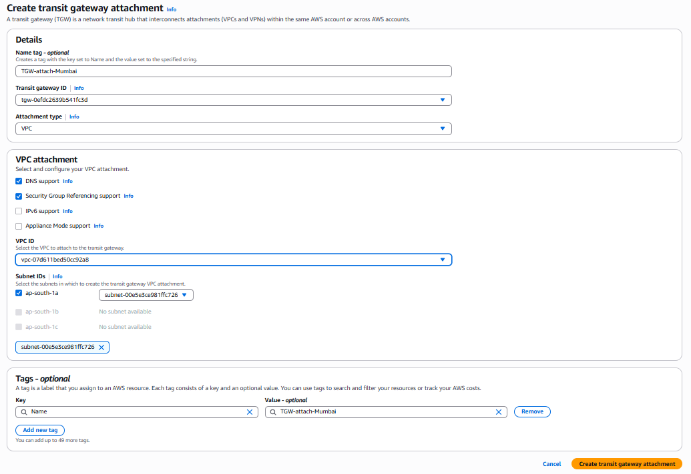
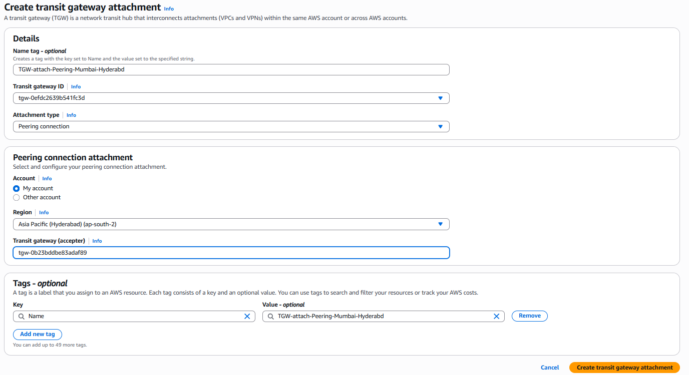
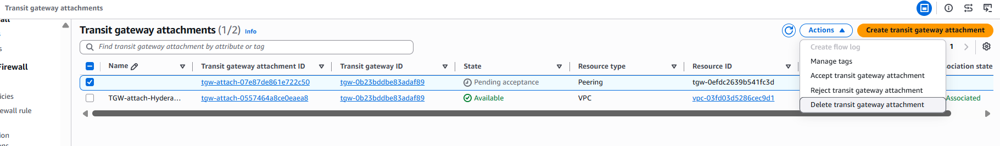
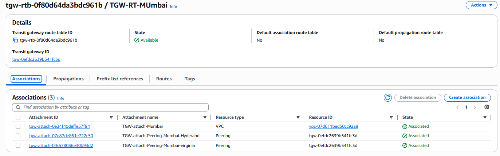
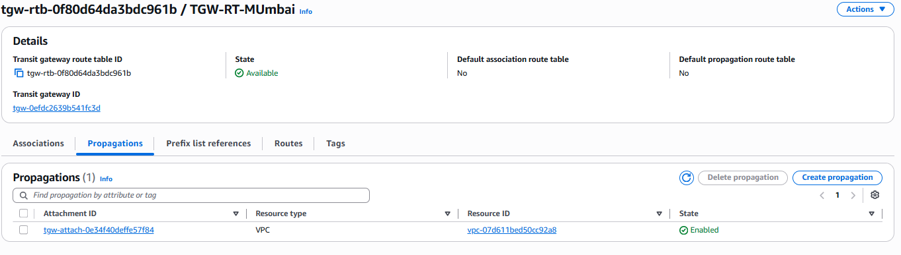
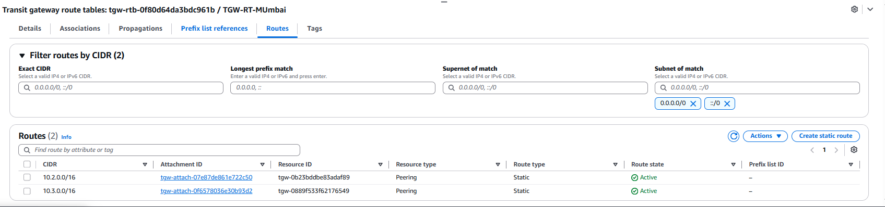
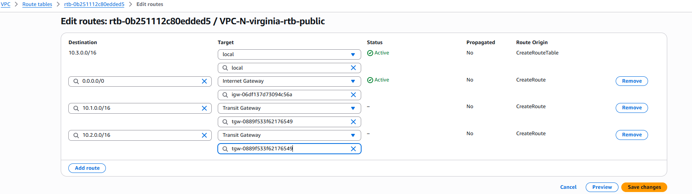
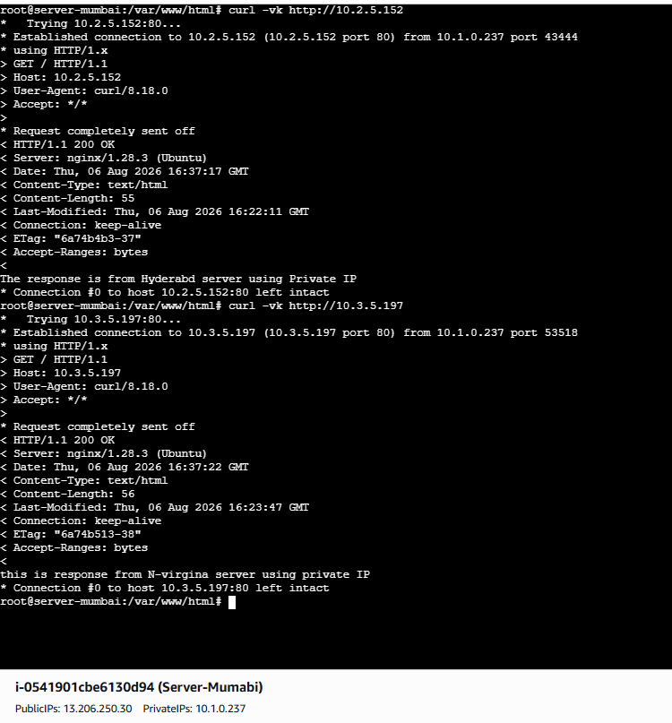
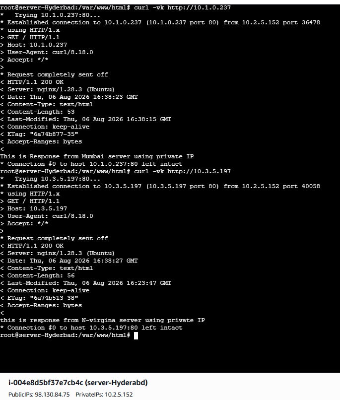
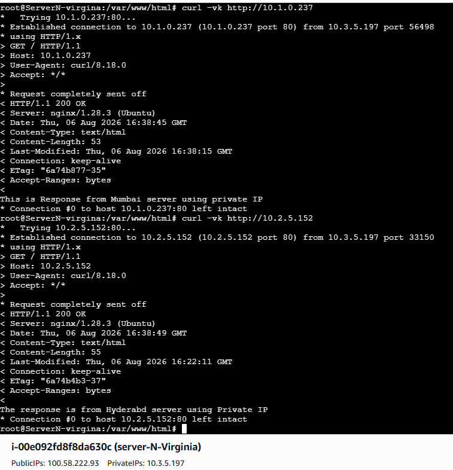

<div align="center">

# 🌐 AWS Transit Gateway (TGW) Multi-Region Architecture
### Connecting Multiple AWS Regions Using AWS Transit Gateway Peering


Build a **scalable**, **secure**, and **centralized** network architecture across multiple AWS Regions using **AWS Transit Gateway**.

</div>

---

## 📑 Table of Contents

1. [Overview](#-overview)
2. [What You'll Build](#-what-youll-build)
3. [Prerequisites](#-prerequisites)
4. [Network Plan](#-network-plan)
5. [Implementation Steps](#-implementation-steps)
   - [1. Create Amazon VPCs](#1️⃣-create-amazon-vpcs)
   - [2. Create Transit Gateways](#2️⃣-create-aws-transit-gateways)
   - [3. Create TGW Route Tables](#3️⃣-create-transit-gateway-route-tables)
   - [4. Create VPC Attachments](#4️⃣-create-vpc-attachments)
   - [5. Create Peering Attachments](#5️⃣-create-transit-gateway-peering-attachments)
   - [6. Accept Peering Requests](#6️⃣-accept-peering-requests)
   - [7. Route Table Associations](#7️⃣-configure-route-table-associations)
   - [8. Route Propagations](#8️⃣-configure-route-propagations)
   - [9. Static Routes](#9️⃣-configure-static-routes)
   - [10. Launch EC2 Instances](#🔟-launch-ec2-instances)
   - [11. Update VPC Route Tables](#1️⃣1️⃣-update-vpc-route-tables)
   - [12. Validate Connectivity](#1️⃣2️⃣-validate-connectivity)
6. [Troubleshooting](#-troubleshooting)
7. [Cleanup (Avoid Charges)](#-cleanup-avoid-charges)
8. [Conclusion](#-conclusion)

---

## 📖 Overview

This project builds a **Multi-Region AWS Network** using **AWS Transit Gateway (TGW)** and **Transit Gateway Peering**, connecting **three VPCs** across **three AWS Regions** so their resources can communicate securely over the **AWS Global Network**.

Unlike traditional **VPC Peering** (a mesh of point-to-point links), Transit Gateway acts as a **centralized routing hub** — easier to manage, scale, and maintain as more regions or VPCs are added.

> **⚠️ Important** — Creating a Transit Gateway alone does **not** enable connectivity. You also need VPC Attachments, TGW Peering, Route Associations, Route Propagations, Static Routes, and updated VPC Route Tables.

<p align="left">
  
</p>

---

## 🎯 What You'll Build

| | | |
|---|---|---|
| ✅ 3 Amazon VPCs | ✅ 3 Transit Gateways | ✅ 3 TGW Route Tables |
| ✅ 3 VPC Attachments | ✅ 3 TGW Peering Attachments | ✅ Route Associations & Propagations |
| ✅ Static Routes | ✅ 3 EC2 Instances | ✅ Validated Cross-Region Connectivity |

---

## ✅ Prerequisites

- An AWS account with permissions for **VPC**, **EC2**, and **Transit Gateway**
- AWS CLI or Console access (this guide uses the **Console**)
- Basic familiarity with IP addressing / CIDR notation
- Budget awareness — Transit Gateway attachments and data transfer incur hourly + per-GB charges (see [Cleanup](#-cleanup-avoid-charges))

---

## 🌍 Network Plan

| Region | AWS Region Code | VPC CIDR | VPC Name | Transit Gateway | TGW Route Table |
|---|---|---|---|---|---|
| Mumbai | `ap-south-1` | `10.1.0.0/16` | Mumbai-VPC | Mumbai-TGW | Mumbai-TGW-RT |
| Hyderabad | `ap-south-2` | `10.2.0.0/16` | Hyderabad-VPC | Hyderabad-TGW | Hyderabad-TGW-RT |
| N. Virginia | `us-east-1` | `10.3.0.0/16` | Virginia-VPC | Virginia-TGW | Virginia-TGW-RT |

> 📌 The console screenshot for each step is identical across Regions — only the values in the table change for **Hyderabad** and **N. Virginia**.

---

## 🚀 Implementation Steps

| Step | Task |
|---|---|
| 1 | Create Amazon VPCs |
| 2 | Create AWS Transit Gateways |
| 3 | Create Transit Gateway Route Tables |
| 4 | Create VPC Attachments |
| 5 | Create Transit Gateway Peering Attachments |
| 6 | Accept Peering Requests |
| 7 | Configure Route Table Associations |
| 8 | Configure Route Propagations |
| 9 | Configure Static Routes |
| 10 | Launch EC2 Instances |
| 11 | Update VPC Route Tables |
| 12 | Validate Connectivity |

---

### 1️⃣ Create Amazon VPCs

Navigate to **VPC → Create VPC → VPC and more** and repeat for each Region below.

| Region | Name tag | IPv4 CIDR | AZs | Public / Private Subnets | NAT Gateway |
|---|---|---|---|---|---|
| 🇮🇳 Mumbai | Mumbai | `10.1.0.0/16` | 1 | 1 / 1 | None |
| 🇮🇳 Hyderabad | Hyderabad | `10.2.0.0/16` | 1 | 1 / 1 | None |
| 🇺🇸 N. Virginia | Virginia | `10.3.0.0/16` | 1 | 1 / 1 | None |

<p align="left">
  
</p>

**Result:** one VPC live in each of the three Regions.

---

### 2️⃣ Create AWS Transit Gateways

Navigate to **VPC → Transit Gateways → Create Transit Gateway** and repeat for each Region below.

| Region | Name | Amazon Side ASN | DNS Support | Default RT Association | Default RT Propagation | VPN ECMP |
|---|---|---|---|---|---|---|
| 🇮🇳 Mumbai | Mumbai-TGW | Default (64512) | Enable | Enable | Enable | Enable |
| 🇮🇳 Hyderabad | Hyderabad-TGW | Default (64512) | Enable | Enable | Enable | Enable |
| 🇺🇸 N. Virginia | Virginia-TGW | Default (64512) | Enable | Enable | Enable | Enable |

<p align="left">
  
</p>

**Result:** one Transit Gateway live in each Region.

---

### 3️⃣ Create Transit Gateway Route Tables

Navigate to **VPC → Transit Gateway Route Tables → Create Transit Gateway Route Table**.

| Region | Route Table Name | Transit Gateway |
|---|---|---|
| 🇮🇳 Mumbai | Mumbai-TGW-RT | Mumbai-TGW |
| 🇮🇳 Hyderabad | Hyderabad-TGW-RT | Hyderabad-TGW |
| 🇺🇸 N. Virginia | Virginia-TGW-RT | Virginia-TGW |

<p align="left">
  
</p>

---

### 4️⃣ Create VPC Attachments

Navigate to **VPC → Transit Gateway Attachments → Create** (Attachment Type: **VPC**).

| Region | Attachment Name | Transit Gateway | VPC | Subnet |
|---|---|---|---|---|
| 🇮🇳 Mumbai | TGW-attach-Mumbai | Mumbai-TGW | Mumbai-VPC | 1 selected |
| 🇮🇳 Hyderabad | TGW-attach-Hyderabad | Hyderabad-TGW | Hyderabad-VPC | 1 selected |
| 🇺🇸 N. Virginia | TGW-attach-Virginia | Virginia-TGW | Virginia-VPC | 1 selected |

<p align="left">
  
</p>

**Result:** all three attachments reach **Available** status under Transit Gateway Attachments.

---

### 5️⃣ Create Transit Gateway Peering Attachments

Navigate to **VPC → Transit Gateway Attachments → Create** (Attachment Type: **Peering Connection**). Peering is bidirectional — only **one** attachment per pair is needed.

| Peering Pair | Attachment Name | Transit Gateway | Peer Region | Peer TGW |
|---|---|---|---|---|
| Mumbai → Hyderabad | TGW-Peer-Mumbai-Hyderabad | Mumbai-TGW | ap-south-2 | Hyderabad-TGW |
| Mumbai → N. Virginia | TGW-Peer-Mumbai-Virginia | Mumbai-TGW | us-east-1 | Virginia-TGW |
| Hyderabad → N. Virginia | TGW-Peer-Hyderabad-Virginia | Hyderabad-TGW | us-east-1 | Virginia-TGW |

<p align="left">
  
</p>

**Result:** each attachment shows **Pending Acceptance** until accepted in the peer Region (next step).

---

### 6️⃣ Accept Peering Requests

Switch to each **destination Region → VPC → Transit Gateway Attachments**, select the pending attachment, then **Actions → Accept**.

| Peering | Accept In |
|---|---|
| Mumbai ↔ Hyderabad | Hyderabad |
| Mumbai ↔ N. Virginia | N. Virginia |
| Hyderabad ↔ N. Virginia | N. Virginia |

<p align="left">
  
</p>

**Result:** all three peering attachments show **Available**.

---

### 7️⃣ Configure Route Table Associations

In **Transit Gateway Route Tables → [Table] → Associations → Create Association**, associate each Region's route table with its **VPC attachment** and its **two peering attachments**.

| TGW Route Table | Associated Attachments |
|---|---|
| Mumbai-TGW-RT | TGW-attach-Mumbai, TGW-Peer-Mumbai-Hyderabad, TGW-Peer-Mumbai-Virginia |
| Hyderabad-TGW-RT | TGW-attach-Hyderabad, TGW-Peer-Mumbai-Hyderabad, TGW-Peer-Hyderabad-Virginia |
| Virginia-TGW-RT | TGW-attach-Virginia, TGW-Peer-Mumbai-Virginia, TGW-Peer-Hyderabad-Virginia |

<p align="left">
  
</p>

> Note: an attachment can associate with only **one** route table at a time.

---

### 8️⃣ Configure Route Propagations

In **Transit Gateway Route Tables → [Table] → Propagations → Create Propagation**, enable propagation for each Region's **own VPC attachment** — this auto-adds the local CIDR as a **Propagated** route.

| TGW Route Table | Propagated Attachment | Propagated CIDR |
|---|---|---|
| Mumbai-TGW-RT | TGW-attach-Mumbai | `10.1.0.0/16` |
| Hyderabad-TGW-RT | TGW-attach-Hyderabad | `10.2.0.0/16` |
| Virginia-TGW-RT | TGW-attach-Virginia | `10.3.0.0/16` |

<p align="left">
  
</p>

---

### 9️⃣ Configure Static Routes

Remote CIDRs aren't learned automatically — add them manually in **Routes → Create Static Route**, pointing to the matching peering attachment.

| TGW Route Table | Destination CIDR | Target |
|---|---|---|
| Mumbai-TGW-RT | `10.2.0.0/16` | Peer → Hyderabad |
| Mumbai-TGW-RT | `10.3.0.0/16` | Peer → Virginia |
| Hyderabad-TGW-RT | `10.1.0.0/16` | Peer → Mumbai |
| Hyderabad-TGW-RT | `10.3.0.0/16` | Peer → Virginia |
| Virginia-TGW-RT | `10.1.0.0/16` | Peer → Mumbai |
| Virginia-TGW-RT | `10.2.0.0/16` | Peer → Hyderabad |

<p align="left">
  
</p>

**Result:** each route table now holds **1 Propagated + 2 Static** routes covering all three CIDRs.

---

### 🔟 Launch EC2 Instances

Launch one instance per Region: **EC2 → Launch Instance**. Public subnet, auto-assign public IP, Security Group allowing **SSH (22)**, **HTTP (80)**, and ICMP as needed.

| Region | Name | VPC | AMI | Type |
|---|---|---|---|---|
| 🇮🇳 Mumbai | server-mumbai | Mumbai-VPC | Ubuntu 24.04 LTS | t2.micro |
| 🇮🇳 Hyderabad | server-hyderabad | Hyderabad-VPC | Ubuntu 24.04 LTS | t2.micro |
| 🇺🇸 N. Virginia | server-virginia | Virginia-VPC | Ubuntu 24.04 LTS | t2.micro |

> 💡 Enhancement: install a quick web server on boot via **User Data** so Step 12 has something to `curl`:
> ```bash
> #!/bin/bash
> apt update -y && apt install -y nginx
> systemctl enable nginx --now
> ```

---

### 1️⃣1️⃣ Update VPC Route Tables

Instances sit in **public subnets**, so update each **public route table** (**VPC → Route Tables → Edit Routes**) to send remote-CIDR traffic to the local TGW.

| VPC | Destination CIDR | Target |
|---|---|---|
| Mumbai | `10.2.0.0/16` | Mumbai-TGW |
| Mumbai | `10.3.0.0/16` | Mumbai-TGW |
| Hyderabad | `10.1.0.0/16` | Hyderabad-TGW |
| Hyderabad | `10.3.0.0/16` | Hyderabad-TGW |
| N. Virginia | `10.1.0.0/16` | Virginia-TGW |
| N. Virginia | `10.2.0.0/16` | Virginia-TGW |

<p align="left">
  
</p>

> Using **private subnets** instead? Apply the same routes to the private route tables.

---

### 1️⃣2️⃣ Validate Connectivity

Confirm first: all Attachments **Available**, Associations/Propagations/Static Routes configured, VPC route tables updated, instances **Running**, Security Groups allow HTTP + SSH.

| From | Test Command |
|---|---|
| 🇮🇳 Mumbai | `curl -vk http://10.2.5.152` (Hyderabad) · `curl -vk http://10.3.5.197` (Virginia) |
| 🇮🇳 Hyderabad | `curl -vk http://10.1.0.237` (Mumbai) · `curl -vk http://10.3.5.197` (Virginia) |
| 🇺🇸 N. Virginia | `curl -vk http://10.1.0.237` (Mumbai) · `curl -vk http://10.2.5.152` (Hyderabad) |

<p align="left">
  <br>
  <br>
  
</p>

**Result:** a response of **`HTTP/1.1 200 OK`** from each remote private IP confirms cross-region connectivity via the Transit Gateways.

---

## 🛠 Troubleshooting

| Symptom | Likely Cause | Fix |
|---|---|---|
| `curl` times out | Missing static route or association | Re-check Steps 7 & 9 for that Region's TGW-RT |
| Peering stuck at "Pending Acceptance" | Not yet accepted in peer Region | Repeat Step 6 in the destination Region |
| Connects locally but not cross-region | VPC route table not updated | Re-check Step 11 for the source VPC |
| `curl` refused (not timeout) | No web server running on target EC2 | Install/start nginx or check Security Group port 80 |
| Attachment shows "Failed" | CIDR overlap or subnet misconfiguration | Confirm each Region uses a non-overlapping `/16` per the Network Plan |

---

## 🧹 Cleanup (Avoid Charges)

Transit Gateway attachments and running EC2 instances bill hourly. To avoid ongoing cost, tear down in this order:

1. Terminate all 3 **EC2 instances**
2. Delete **Static Routes** and **Associations** in each TGW Route Table
3. Delete the 3 **VPC Attachments**
4. Delete the 3 **Peering Attachments**
5. Delete the 3 **Transit Gateway Route Tables**
6. Delete the 3 **Transit Gateways**
7. Delete the 3 **VPCs**

---

## 🎉 Conclusion

You've built a fully working **Multi-Region AWS Transit Gateway Architecture** connecting **Mumbai** (`10.1.0.0/16`), **Hyderabad** (`10.2.0.0/16`), and **N. Virginia** (`10.3.0.0/16`) — with VPCs, Transit Gateways, TGW Route Tables, VPC and Peering Attachments, Route Associations/Propagations, Static Routes, updated VPC Route Tables, and validated HTTP connectivity across all three Regions.

This setup shows how Transit Gateway replaces a fragile full-mesh of VPC Peering connections with one **centralized, scalable hub-and-spoke model** for secure inter-region networking on the AWS Global Network.