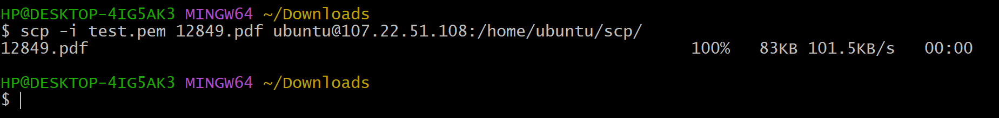
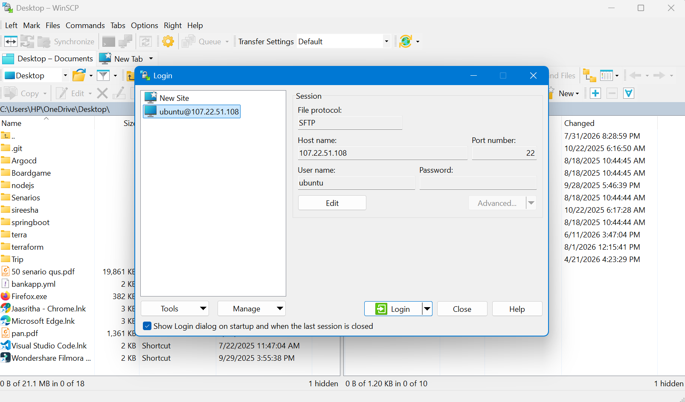
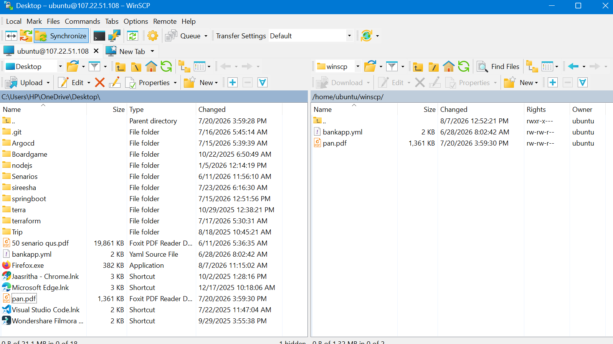
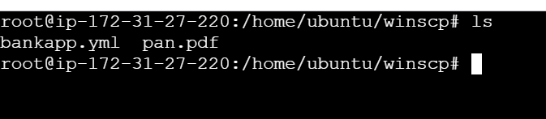

# Upload a Local File to an EC2 Instance Using SCP / WinSCP

This guide explains how to upload a local file from your computer to an AWS EC2 instance using either **SCP (Command Line)** or **WinSCP (GUI for Windows)**.

---

# Method 1: Using SCP (Command Line)

## What is SCP?

**SCP (Secure Copy Protocol)** is a command-line utility that securely transfers files and directories between a local computer and a remote server over **SSH (Secure Shell)**.

### Purpose of SCP

- Securely upload files from your local system to a remote server (such as an EC2 instance).
- Download files from a remote server to your local system.
- Transfer files between two remote servers (when supported).
- Encrypt data during transfer using SSH, protecting it from interception.

---

## Step 1: Launch an EC2 Instance

1. Launch an **EC2 instance** (Ubuntu or Amazon Linux).
2. Download the **.pem** key pair while creating the instance.
3. Ensure the **Security Group** allows **SSH (Port 22)** from your IP address.

---

## Step 2: Note the EC2 Public IP

1. Open the **AWS EC2 Console**.
2. Select your EC2 instance.
3. Copy the **Public IPv4 Address**.

### Example

```text
13.233.100.25
```

---

## Step 3: Open Terminal / PowerShell

Navigate to the folder containing your **.pem** key.

### Linux/macOS

```bash
cd /path/to/key
```

### Windows PowerShell

```powershell
cd C:\Users\<YourUser>\Downloads
```

---

## Step 4: Upload the File Using SCP

### Syntax

```bash
scp -i <key-name>.pem <local-file> <username>@<EC2-Public-IP>:<destination-path>
```

### Example (Ubuntu)

```bash
scp -i my-key.pem sample.txt ubuntu@13.233.100.25:/home/ubuntu/scp/
```

### Screenshot: Local SCP




---

## Step 5: Connect to the EC2 Instance

### Ubuntu

```bash
ssh -i my-key.pem ubuntu@13.233.100.25
```

### Amazon Linux

```bash
ssh -i my-key.pem ec2-user@13.233.100.25
```

---

## Step 6: Verify the Uploaded File

### List Files

```bash
ls -l
```
### Screenshot: remote SCP


---

# Method 2: Using WinSCP (GUI - Windows)

## What is WinSCP?

**WinSCP (Windows Secure Copy)** is a free graphical file transfer application for Windows that supports **SCP**, **SFTP**, **FTP**, and **WebDAV**.

### Purpose of WinSCP

- Transfer files securely between a Windows computer and a remote server.
- Manage files on a remote server using a graphical interface instead of command-line commands.

### Why We Use WinSCP

- Easy drag-and-drop file transfers.
- No need to remember command-line syntax.
- User-friendly graphical interface.
- Secure file transfers using SSH.

---

## Step 1: Install WinSCP

Download and install WinSCP from:

**https://winscp.net**

---

## Step 2: Convert the `.pem` File (If Required)

If WinSCP requests a PuTTY private key:

1. Open **PuTTYgen**.
2. Click **Load** and select your **.pem** file.
3. Click **Save private key**.
4. Save it as a **.ppk** file.

> **Note:** Recent versions of WinSCP can use **.pem** files directly.

---

## Step 3: Open WinSCP

Enter the following connection details:

| Field | Value |
|--------|-------|
| **File Protocol** | SCP (or SFTP) |
| **Host Name** | EC2 Public IP |
| **Port Number** | 22 |
| **User Name** | `ubuntu` (Ubuntu) or `ec2-user` (Amazon Linux) |

---

## Step 4: Select the Private Key

1. Click **Advanced**.
2. Navigate to **SSH → Authentication**.
3. Browse and select your **.pem** or **.ppk** file.
4. Click **OK**.

### Screenshot: winscp-login



---

## Step 5: Connect to the EC2 Instance

1. Click **Login**.
2. Accept the server's host key if prompted.


---

## Step 6: Upload the File

1. The **left pane** displays your local computer.
2. The **right pane** displays the EC2 instance.
3. Drag and drop the file from the left pane to the desired directory on the EC2 instance.

**Example destination directories:**

- Ubuntu

```text
/home/ubuntu/winscp/
```
### Screenshot: winscp-local-remote



---

## Step 7: Verify the Upload

Connect to the EC2 instance using SSH and run:

```bash
ls -l
```

### Screenshot: winscp-validation



You should see the uploaded file in the destination directory.
